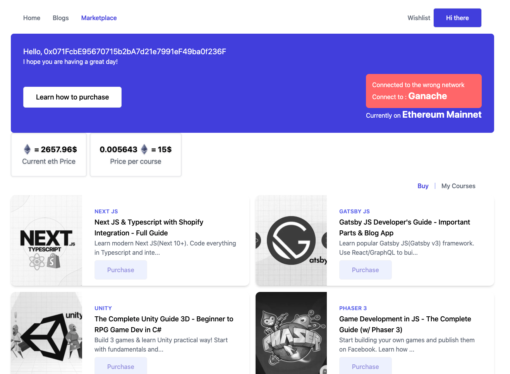

# Marketplace Application

An interactive marketplace where clients can purchase courses(students can choose products of their choice) with Ether digital currency.
It features marketplace page with real-time updates of Ether currency and course prices compared to the US dollar.

Has a modal window dedicated to making orders. Email hashing solution to maintain client's privacy. Order view with order filtering and pagination, and many others.

The application is built using the Next JS framework with Tailwind CSS framework. Next JS is internally using React library. It offers SSR(server-side rendering) by default.



## Live Demo
[Live Demo](#)

## Getting Started

To get a local copy up and running follow these simple example steps.

### Prerequisites

- Make sure Node.js is running on your local machine
- Setup Ganache and truffle on your local machine

### Setup

~~~bash
$ git clone git@github.com:acushlakoncept/dapps-marketplace.git
$ cd dapps-marketplace
~~~

Install modules:

```
npm install
```

### Usage

First, run the development server:

```bash
npm run dev
# or
yarn dev
```

### Compile Contract
// --reset flag forcefully recompiles the contract

```
truffle migrate --reset
```

### Running Test
`truffle test`

### Get Some Ropsten Ether for test networ
- [https://moonborrow.com/](moonborrow.com)
- [https://faucet.dimensions.network/](faucet.dimensions.network)
- [https://faucet.metamask.io/](faucet.metamask.io)
- [https://faucet.ropsten.be/](faucet.ropsten.be)
- [https://faucet.egorfine.com/](faucet.egorfine.com)
# Author

👤 **Uduak Essien**

- Github: [@acushlakoncept](https://github.com/acushlakoncept/)
- Twitter: [@acushlakoncept](https://twitter.com/acushlakoncept)
- Linkedin: [acushlakoncept](https://www.linkedin.com/in/acushlakoncept/)

## 🤝 Contributing

Contributions, issues and feature requests are welcome!

Feel free to check the [issues page](issues/).

## Show your support

Give a ⭐️ if you like this project!

## Acknowledgments
- Solidity & Ethereum in React (Next JS): The Complete Guide by Filip Jerga


